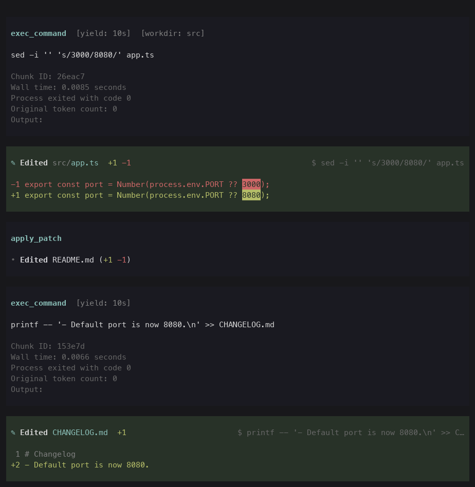

# Readable edits for Pi

See what your agent changed when it edits files through the shell.

Pi's `edit` and `write` tools show a diff. But models often skip them and edit with `sed -i`, a heredoc or a Python one-off, and then Pi shows you the command, not the change. This extension adds a diff card right after the command, in the same style as Pi's own `edit` tool.


## Why

It happens more than you'd think. Counting every file edit in the author's own transcripts (shell edits found by this extension's parser, so if anything an undercount):

| Model | Harness | Edits made through the shell |
|---|---|---|
| Claude | Claude Code | 31% (1,329 of 4,326) |
| GLM | Pi | 22% (124 of 567) |
| Kimi | Pi | 20% (49 of 246) |
| DeepSeek | Pi | 16% (18 of 110) |
| GPT | Pi with `apply_patch` | 4% (25 of 663) |

For most models, roughly one edit in five reaches you as a shell command. A 40-line Python heredoc tells you what the model *meant* to do; it doesn't show what actually changed, or whether a `replace()` hit the right spot. Without the card, you only find out when you open the files or run `git diff`.

## Install

```sh
pi install git:github.com/shidenkai0/pi-readable-edits
```

Or try it for a single session without installing: `pi -e git:github.com/shidenkai0/pi-readable-edits`.

Nothing to configure. The card shows up the first time a shell command edits a file.

## What you see

- **The files the command edited:** creations, deletions, renames and binary files. One file gets a titled diff. Several get a file list with `+/−` counts, then a diff per file.
- **Pi's own diff rendering:** the same colors, line numbers and word-level highlights as the `edit` tool, with long lines wrapped under a hanging indent.
- **Short by default:** small diffs show in full. Large ones show a preview and expand with Pi's usual key (`ctrl+o`).
- **Safe to keep:** `.env*`, keys and credential files show line counts but never contents. Lockfiles and generated files stay collapsed.
- **Honest attribution:** a failed command is marked `failed`. Commands that ran in parallel share one card. Files that a tool with its own diff (`edit`, `write`, `apply_patch`) changed at the same time are left to that tool.

The card is a session entry for you only. It is **never sent to the model**, and the command's own output is untouched.

### With OpenAI models

[`pi-openai-codex-compat`](https://github.com/2h2d-co/pi-openai-codex-compat) swaps Pi's `bash` for Codex's `exec_command` or `shell_command`, and its `edit`/`write` for `apply_patch`. Both work with this extension:

- Commands run through `exec_command` or `shell_command` get cards, with paths shown relative to your session even when the command sets a `workdir`.
- `apply_patch` already renders its own diff, so this extension leaves those files alone. That includes `apply_patch` invoked through the shell, and patch files that a parallel shell command also touches.



## How it works

Before a shell command runs, the extension parses it (with tree-sitter; nothing is executed) for the files it writes. It reads those files, and after the command finishes, reads them again and shows what changed. It understands:

- Redirects and heredocs, `tee`, `sed -i`, `perl -i`, `cp`, `mv`, `rm`, `ln` and `git mv`, including variables, `~`, `$HOME`, brace lists, loops and globs.
- Python and Node code inside the command: `open(…, "w")`, `Path.write_text`, `shutil`, `os.rename`, `fs.writeFileSync`, `img.save(…)` and `df.to_csv(…)`, with the variables, loops, f-strings and path joins that feed them.
- Scripts the command writes and then runs, like `cat > /tmp/fix.py <<EOF … EOF; python3 /tmp/fix.py`.

It shows **deliberate edits only**. A formatter, build or package manager that rewrites files on its own isn't an edit the model wrote, so it stays out of the card, and so do writes to temp directories, `.git/`, `node_modules/` and `*.log`. Edits outside the project, like a sibling worktree or `~/.config`, do show.

It observes Pi's tool events instead of replacing the shell tool, so sandboxed, remote, custom-rendered or Codex-style shell tools keep working. The overhead is a fraction of a millisecond per command: about 0.2 ms to parse, plus reading the files it names.

### Why parse the command instead of diffing the repository?

The first version took a Git snapshot before and after every command. It caught every change, but it cost 160–700 ms per command, worked only inside Git repositories, and showed formatter and build churn as if the model had written it. Parsing costs a fraction of a millisecond and shows what the model actually wrote. It gives up edits whose file names only exist at run time, about one edit command in fifteen (measured below). For a quality-of-life feature, that's the better trade.

## How well it works

For each shell command that edits files, the question is whether the card shows every file the command edited. And when a card appears, whether every file on it really changed.

| Model family | Edit commands | Card shows every edited file | Cards with no wrong file |
|---|---|---|---|
| Claude | 119 | 96% | 97% |
| GPT | 64 | 89% | 97% |
| Kimi | 48 | 96% | 96% |
| GLM | 42 | 93% | 93% |
| DeepSeek | 5 | too few to score | |
| **Average of the four** | 273 | **93%** | **96%** |

Of the commands that could write but don't edit anything, about 1 in 200 gets a card. Read-only commands never do.

**How this was measured:**

- **Data:** about 100,000 Bash commands from the author's Claude Code, Codex and Pi transcripts, grouped by model family. The transcripts stay private.
- **Sample:** up to 380 commands per family, 1,815 in all.
  - Commands a strict classifier proves read-only are skipped; they can't edit anything.
  - Commands that look like writes are oversampled (300 per family). The rest are sampled lightly (80 per family) to catch edits that filter would miss.
  - Scores are reweighted to each family's real mix of commands.
- **Labels:** a model labeled each command against a [written rubric](scripts/eval-rubric.md), without seeing the parser's output. Every command where its label and the parser disagreed got a second, independent labeling pass.
- **Averages:** each family counts equally, so one heavily used model doesn't hide how the others do.

**Caveats:** these are one person's sessions, labeled by a model rather than verified by hand. The parser was improved using misses from this same sample, so a fresh sample would likely score a little lower. A family is scored on whatever it happened to do, which is why DeepSeek, with 5 shell edits in the sample, isn't scored.

What's missed: files whose names only exist at run time (`find … -exec`, paths read from another command's output, loops over computed lists), and programs that write files through their own logic (Blender, SQLite, a helper module).

## Commands

`/readable-edits off` and `/readable-edits on` pause and resume the cards.

## Limits

- Changes something else makes to the same files while a command runs (your editor, a watcher) appear in that command's card.
- A command that keeps running after its tool call returns (a background `exec_command` session) is compared when the tool call returns.
- Files over 1 MB and diffs too large to compute quickly are summarized instead of diffed.
- Cards render in Pi's terminal UI. They are stored in the session with diffs capped at 2,400 lines per card.

## Develop

From a checkout, `pnpm install`, then load your working copy with `pi -e "$PWD"`.

```sh
task check      # tests (parser, capture, tracker, rendering, extension) and typecheck
task preview    # render sample cards to .scratch/cards.png with Pi's real theme
task demo       # run real Pi with a scripted model; screenshots in .scratch/
task eval       # score the parser against your local, private labeled sample
```

`task demo` drives a real Pi TUI in a pseudo-terminal with a scripted model (`scripts/demo/`). It uses an isolated config directory, so your personal Pi settings and extensions don't leak in. It needs [`uv`](https://docs.astral.sh/uv/). It is also how the screenshots in `docs/` are made. `--with PATH` loads another extension alongside, as for the OpenAI screenshot above.

### Running the evaluation on your own transcripts

Everything stays in the gitignored `.local/`:

1. `task corpus` streams Bash calls from `~/.claude/projects`, `~/.codex/sessions` and `~/.pi/agent/sessions`.
2. `task eval:sample` draws the per-family sample and splits it into shards in `.local/eval/shards/`.
3. Label each shard with the [rubric](scripts/eval-rubric.md) into `.local/eval/labels/`, as a JSON array per shard.
4. `task eval` prints each family and the averages. Add `--misses` or `--false-cards` to list them. `--split dev` and `--split holdout` score half the sessions each, so you can fix misses from one half and check on the other.

`task eval:share` produces the table in [Why](#why) from your own transcripts.
