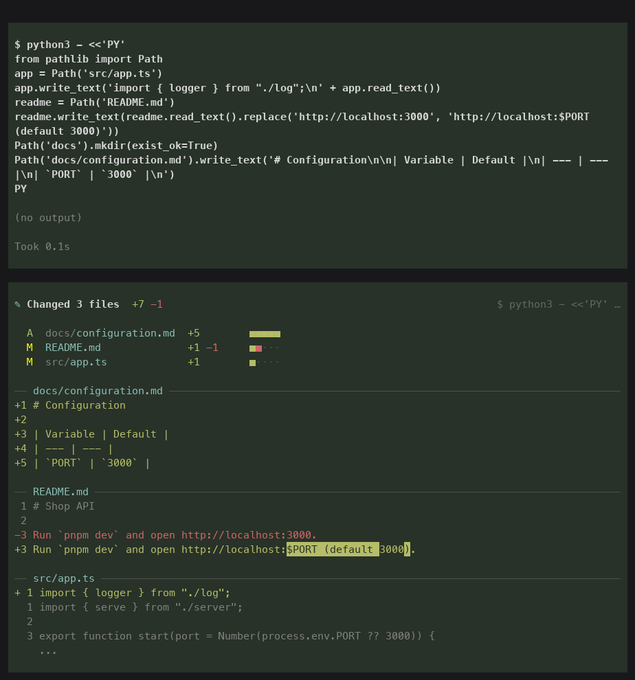

# Readable edits for Pi

When an agent changes files through `bash` (`sed -i`, a heredoc, a Python one-off, a formatter, a codemod), Pi shows you the command, not the change. This extension adds a diff card right after the command, in the same style as Pi's own `edit` tool.



## Install

```sh
pi install git:github.com/shidenkai0/pi-readable-edits
```

Or try it for a single session without installing: `pi -e git:github.com/shidenkai0/pi-readable-edits`.

Nothing to configure. The card shows up the first time a shell command changes a file.

## What you see

- **Every change a command made:** creations, deletions, renames, mode changes and binary files, from any program the command ran. One file gets a titled diff. Several get a file list with `+/−` counts, then a diff per file.
- **Pi's own diff rendering:** the same colors, line numbers and word-level highlights as the `edit` tool, with long lines wrapped under a hanging indent.
- **Short by default:** small diffs show in full. Large ones show a preview and expand with Pi's usual key (`ctrl+o`).
- **Safe to keep:** `.env*`, keys and credential files show line counts but never contents. Lockfiles and generated files stay collapsed.
- **Honest attribution:** a failed command is marked `failed`. Commands that ran in parallel share one card. Files that Pi's `edit`/`write` tools changed at the same time are left to those tools' own diffs.

The card is a session entry for you only. It is **never sent to the model**, and the command's own output is untouched.

## How it works

Before a shell command runs, the extension snapshots the Git worktree. It stages every non-ignored file into a *private* index and object store in a temp directory, seeded from your index so Git's stat cache keeps it fast. When the command finishes, it snapshots again and diffs the two trees. Your real index, `.git/objects` and working tree are never written.

- **It doesn't matter how the edit happened.** `apply_patch`, `black`, `prettier --write`, a script written to `/tmp` and then run: anything that changes files shows up. `.gitignore` keeps build output and `node_modules` out.
- **Commands that only read are skipped.** A strict parser recognizes read-only commands (`ls`, `rg`, `cat`, `git status`, `sed -n`, …) and skips snapshots for them. That covered 61% of 4,944 real agent commands, with no real edit misclassified. Anything it doesn't recognize is snapshotted.
- **It never gets in the way.** If a snapshot fails or times out, the command still runs. Repositories whose snapshots are consistently slow (over 1.5 s twice, or one over 4 s) switch to the fallback below, and you get a one-time notice.
- **Outside Git** (or in a repository that fell back), the extension statically parses the command for the files it names (redirects, heredocs, `tee`, `sed -i`, `perl -i`, `cp`, `mv`, `rm`, and file writes in inline Python and Node) and diffs just those.
- **It composes.** It observes Pi's tool events instead of replacing the `bash` tool, so sandboxed, remote or custom-rendered `bash` implementations keep working.

Typical overhead for a command that may write is two snapshots: about 50 ms each in a 1,000-file repository, and 130 ms in VS Code's 19,000 files.

## Commands

`/readable-edits status` shows how each repository is observed and the average snapshot time. `/readable-edits off` and `/readable-edits on` pause and resume observation.

## Limits

- Only the Git worktree containing Pi's working directory is observed. Edits in other repositories or in `/tmp` don't appear.
- Ignored files never appear. Submodules show commit changes, not their contents.
- Changes something else makes while a command is running (your editor, a watcher writing tracked files) are included in that command's card.
- Outside Git, the fallback only sees files a command names directly.
- Cards render in Pi's terminal UI. They are stored in the session with diffs capped at 2,400 lines per card.

## Develop

From a checkout, `pnpm install`, then load your working copy with `pi -e "$PWD"`.

```sh
task check      # tests (Git engine, parser, tracker, rendering, extension) and typecheck
task preview    # render sample cards to .scratch/cards.png with Pi's real theme
task demo       # run real Pi with a scripted model; screenshots in .scratch/
task eval       # score the fallback parser against your local, private transcript labels
```

`task demo` drives a real Pi TUI in a pseudo-terminal with a scripted model (`scripts/demo/`). It uses an isolated config directory, so your personal Pi settings and extensions don't leak in. It needs [`uv`](https://docs.astral.sh/uv/). It is also how `docs/card.png` is made.

### Fallback parser evaluation

`task eval` streams Bash calls from `~/.claude/projects` and `~/.codex/sessions` into the gitignored `.local/` and scores the parser against labels there. On a frozen private set of 4,944 calls, labeled by a model (a reference, not verified ground truth), the parser finds the exact target set for 204 of 211 edit calls, with 4 false positives among 4,706 other calls, at 0.08 ms per call. Five of the seven misses are commands no parser can follow, like running a generated script or a formatter. Git mode catches those.
